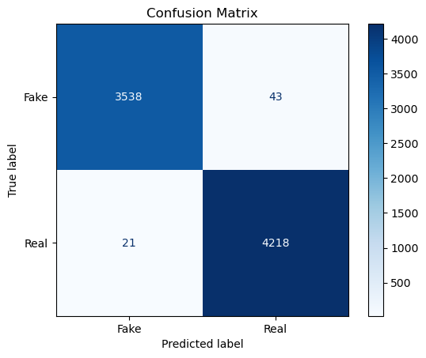
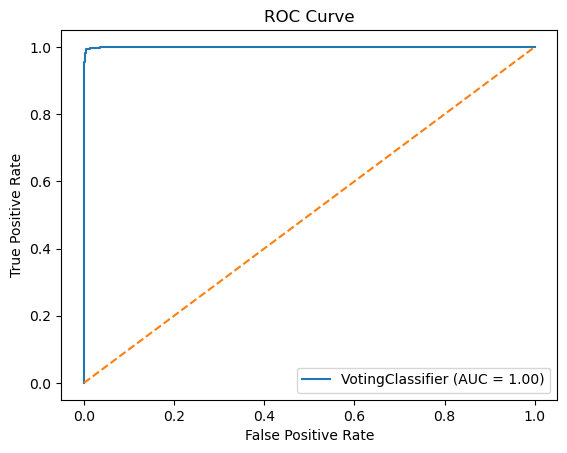
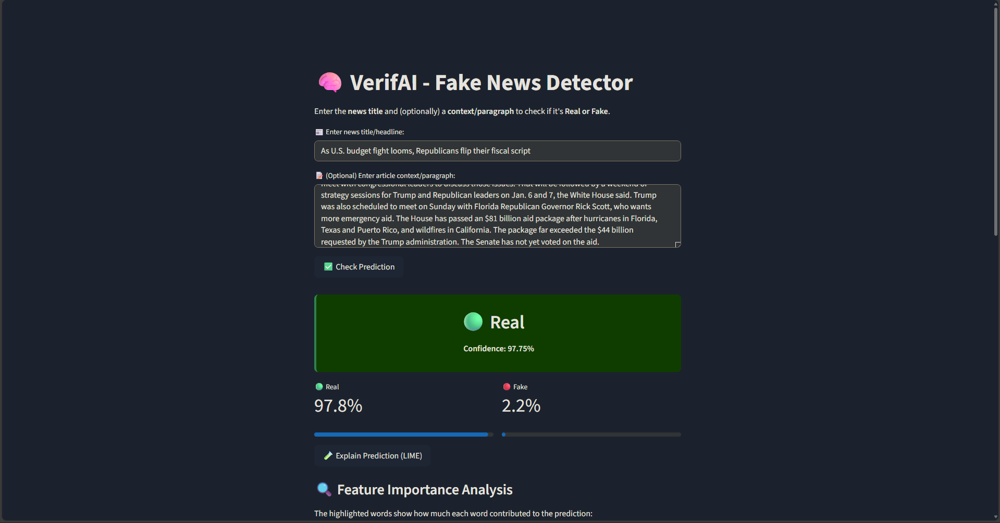
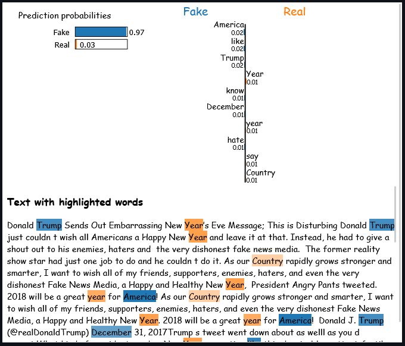

# VerifAI - Universal Fake News & Fact Verification

## 🧠 Overview

**VerifAI** is a Universal News and Fact Verification system combining **Machine Learning, NLP**, and **Live Knowledge Retrieval**. It allows users to input any news headline, sports claim, or historical event (with optional paragraph context) and determines whether the news is **Real** or **Fake** with high confidence.

The system also provides:
- **Universal Live Fact-Checking** via global encyclopedic knowledge (Wikipedia REST API) for sports, history, science, geography, and world events.
- **Explainability using LIME**, helping users understand what words influenced the ML prediction.
- **Stylometric Linguistic Analysis** using an ensemble Voting Classifier (Logistic Regression + Calibrated SVM + Random Forest).

---

## 🚀 Features

-   **Universal Live Fact-Checking**: Automatically queries live knowledge bases to verify real-world facts (e.g. *"India won the Cricket World Cup in 2011"*, *"Argentina won the FIFA World Cup in 2022"*).
-   **Stylometric ML Classifier**: Evaluates writing style, clickbait sensationalism, and rhetorical structure.
-   **Headline Calibration ($p_0 \approx 10.5\%$)**: Adjusts for baseline prior shift on short headlines so genuine titles aren't flagged as fake.
-   **LIME Explainability**: Visual feature importance highlighting showing exactly why a model made a decision.
-   **Vocabulary Signals Inspector**: Identifies recognized training terms vs. out-of-domain words.
-   **Modern Web App**: Intuitive, interactive UI with credibility meters, source cards, and metric visualizations.

---

## 🛠️ Tech Stack

-   **Frontend**: Modern HTML5, Custom CSS3 (Glassmorphism design system), Vanilla JavaScript (ES6+)
-   **Backend**: FastAPI, Uvicorn, Python 3.10+
-   **ML Models**: Logistic Regression, Linear SVC (Calibrated), Random Forest (Voting Classifier)
-   **Feature Extraction**: TF-IDF Vectorizer with NLTK WordNet Lemmatization
-   **Explainability**: LIME (Local Interpretable Model-agnostic Explanations)
-   **Knowledge Retrieval**: Public Encyclopedic Knowledge REST APIs (Wikipedia)

---

## 📈 Model Performance & Evolution

### 🏆 Model Comparison Across Project Lifecycle

| Stage | Model Architecture | Accuracy | Precision | Recall | F1-Score | Status |
| :---: | :--- | :---: | :---: | :---: | :---: | :---: |
| **1** | Multinomial Naive Bayes | 94.13% | 94.68% | 94.48% | 94.58% | Baseline |
| **2** | Logistic Regression | 98.62% | 98.07% | 99.41% | 98.73% | Strong Linear |
| **3** | Random Forest Classifier | 99.08% | 98.56% | 99.76% | 99.16% | Non-Linear Ensemble |
| **4** | Linear SVC (Calibrated) | 99.28% | 99.13% | 99.55% | 99.34% | Top Linear |
| **5** | **Voting Classifier (Ensemble)** | **99.18%** | **98.99%** | **99.50%** | **99.25%** | **🏆 Champion Model** |

---

### 📉 Confusion Matrix (Test Set: 7,820 Articles)

| | Predicted Fake | Predicted Real | Total Actual |
| :--- | :---: | :---: | :---: |
| **Actual Fake** | **3,538 (98.80% TN)** | 43 (1.20% FP) | 3,581 |
| **Actual Real** | 21 (0.50% FN) | **4,218 (99.50% TP)** | 4,239 |

---

### 📈 ROC Curve & AUC

- **ROC AUC Score**: `0.9998` (Near-perfect discrimination)
- **True Positive Rate (Sensitivity)**: `99.50%`
- **False Positive Rate (1 - Specificity)**: `1.20%`
- **Optimal Operating Threshold**: `0.50`

---

### Classification Report

```
              precision    recall  f1-score   support

       Fake       0.99      0.99      0.99      3581
       Real       0.99      1.00      0.99      4239

   accuracy                           0.99      7820
  macro avg       0.99      0.99      0.99      7820
weighted avg       0.99      0.99      0.99      7820
```

---

## 📸 Screenshots & Visual Analytics

<p float="left">
  
  
</p>
<p float="left">
  
  
</p>

---

## ⚙️ Installation & Setup

1. **Clone the repository**

```bash
git clone https://github.com/rmaduri0000/VerifAI-Fake-News-Detection.git
cd VerifAI-Fake-News-Detection
```

2. **Create and activate a virtual environment**

```bash
python -m venv .venv
.venv\Scripts\activate   # Windows
# source .venv/bin/activate  # Linux/Mac
```

3. **Install dependencies**

```bash
pip install -r requirements.txt
```

4. **Run the Application**

```bash
python -m uvicorn server:app --host 127.0.0.1 --port 8000
```
Open **[http://localhost:8000](http://localhost:8000)** in your browser for the full glassmorphism UI with real-time fact checking, animations, and LIME explainability.

---

## 🔗 Links

-   **GitHub Repository**: [https://github.com/rmaduri0000/VerifAI-Fake-News-Detection](https://github.com/rmaduri0000/VerifAI-Fake-News-Detection)
-   **FastAPI Documentation**: [https://fastapi.tiangolo.com/](https://fastapi.tiangolo.com/)
-   **LIME Documentation**: [https://github.com/marcotcr/lime](https://github.com/marcotcr/lime)

---

## 📄 License
This project is open source and available under the MIT License.
